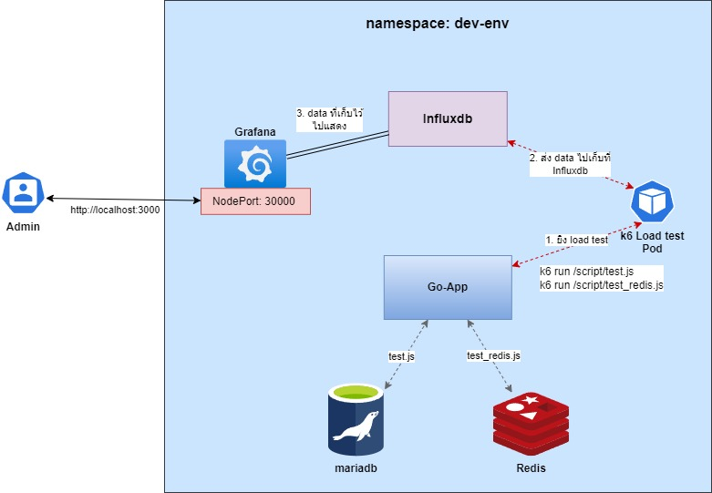

# Golang + Redis

# ทำผ่าน Kubernetes

    โปรเจคนี้จะทำการยิง load test ด้วย k6 เข้าไปยัง app ซึ่ง ตัว app จะ run
    บน Kubernetes ซึ่งจะมี mariadb, redis, grafana และ influxdb ที่ run
    อยู่บน kubernetes ด้วย ซึ่งเราจะสร้าง k6 ยิงเข้าไปโดยที่จะสร้าง k6 เป็น pod
    เพื่อทำการยิงไปยัง app  

  

    สามารถ ใช้ image ของ app ที่ทำการ build มาแล้วได้
    - docker load -i app-loadtest.tar หรือจะ build ขึ้นมาใหม่จาก Dockerfile
    ทำการ apply ของขึ้น kubernetes
    - kubectl apply -f k8s/redis/
    - kubectl apply -f k8s/mariadb/
    - kubectl apply -f k8s/influxdb/
    - kubectl apply -f k8s/grafana/
    - kubectl apply -f k8s/app/
    จากนั้น ให้ไปที่ localhost:30000 เพื่อ monitor traffic
    - สร้าง data source โดยเลือก influxdb และใส่ url http://influxdb-service:8086 
    - เลือก dashboard กรอก ID 2587 แล้วเลือก data source ที่เราสร้างก่อนหน้า
    ทำการยิง load test เอา config ไปเก็บไว้ก่อน 
    - kubectl apply -f k8s/loadimpact/k6_config.yml
    ยิง load test 
    - kubectl apply -f k8s/loadimpact/k6_pod.yml 

# ทำผ่าน docker-compose 
Run Go 
- go run . / go run main.go

Check go API
- curl localhost:8000/products
- curl localhost:8000/products/redis

Run Mariadb & Redis & Grafana & Influxdb
- docker-compose up mariadb redis grafana influxdb

Watch Grafana Dashboard
- Open Browser localhost:3000 (Grafana Dashboard)
- Click Dashboard
- Click k6 Load Testing Results

Run Load test Database
- docker-compose run --rm k6 run /script/test.js

Run Load test Redis
- docker-compose run --rm k6 run /script/test.js

